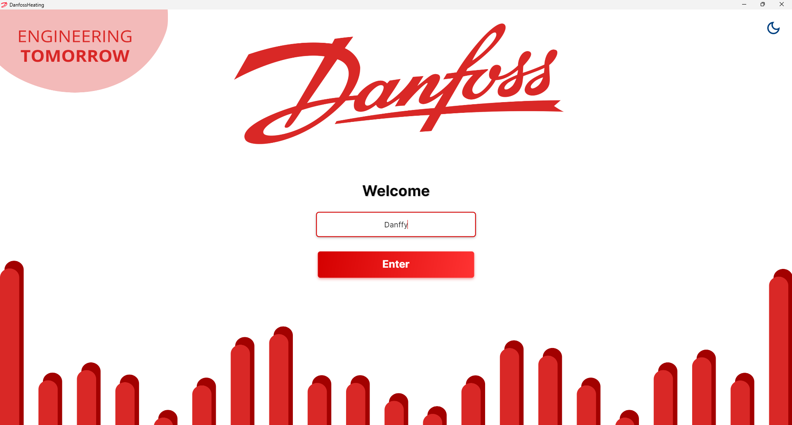
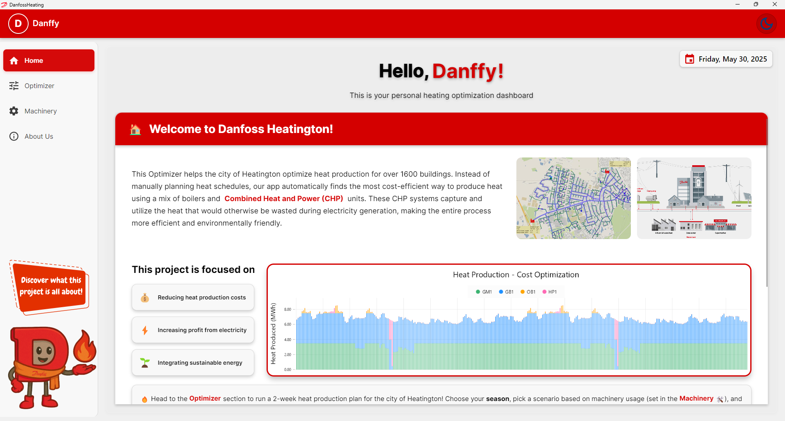
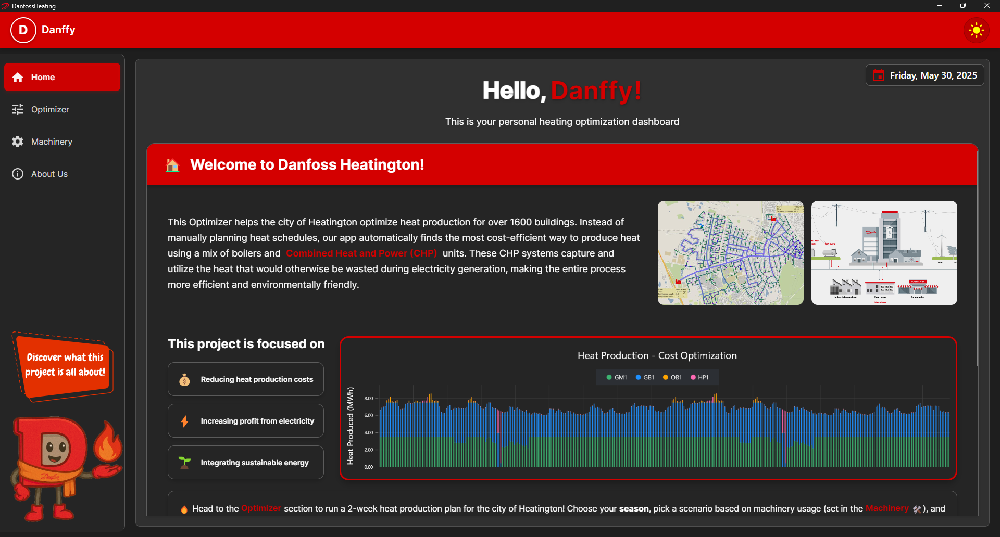
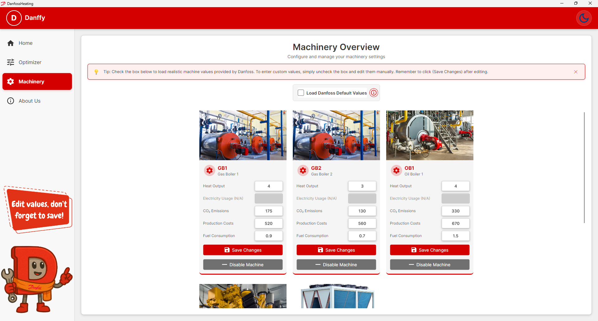
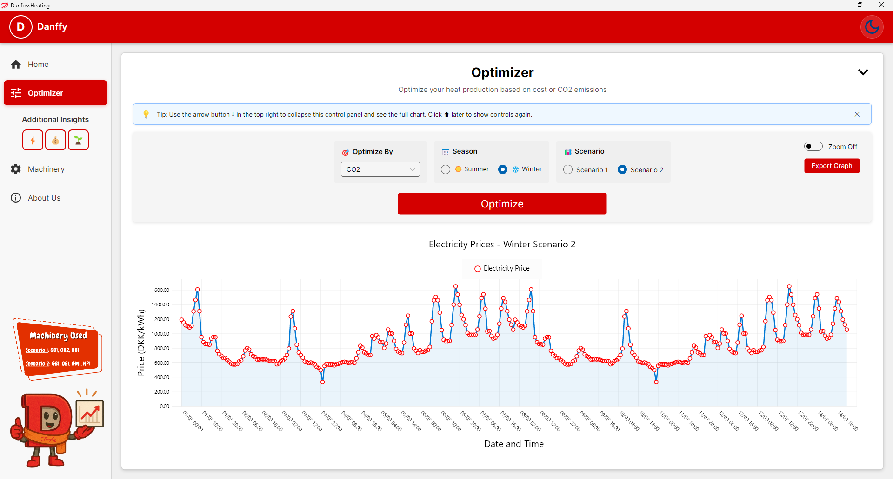
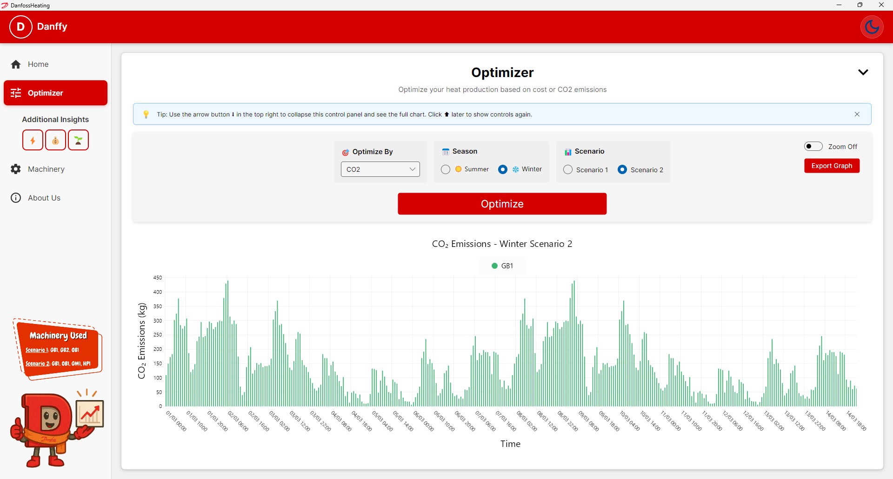
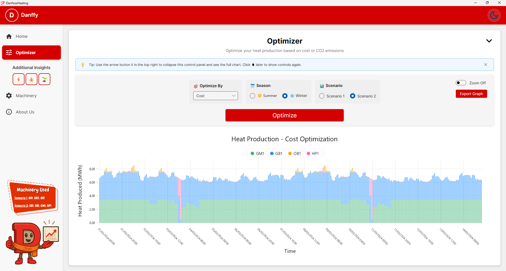

# Semester Project - Heat Production Optimization App

**⚠️ Note for the Reviewer:**
This application uses CSV and JSON files in the `/Data` folder. You can test the optimization with sample data for heat demand and electricity prices.

## 🚀 Getting Started

Run the application in two modes:

- **GUI mode:** From the project root, run:
  ```
  dotnet run
  ```
  This starts the Avalonia-based graphical interface.

- **Console mode:** From the project root, run:
  ```
  dotnet run -- --term
  ```
  This starts the original console-only version.

The application is written in **C#**.

## 📌 Project Overview

This app automates district heating schedules for the city of Heatington. It finds the cheapest way to meet heat demand while maximizing electricity market profits. Built with Avalonia for a modern UI and modular design for clear data flow.

## 🎯 Features

- **Cost Optimization**: Calculates the cheapest mix of heat units hour by hour.
- **Dark Mode**: Toggle between light and dark themes.
- **Downtime Management**: Enable or disable individual machines for maintenance.
- **Customizable Unit Settings**: Edit production values, costs, and limits for each machine.
- **Modules**:
  - **Asset Manager (AM)**: Static data for machines and grid layout.
  - **Source Data Manager (SDM)**: Time series for heat demand and electricity prices.
  - **Result Data Manager (RDM)**: Saves optimization results to CSV.
  - **Optimizer (OPT)**: Core logic for schedule generation.
  - **Data Visualization (DV)**: Graphs for demand, production, costs, and emissions.
- **Unit Testing**: Verifies that methods and modules work correctly. We wrote:
- 4 tests for Asset Manager (AM)
- 3 for Source Data Manager (SDM)
- 3 for Optimizer (OPT)
- 2 for Result Data Manager (RDM)
- 2 for User Interface (UI)
- 4 functional tests

## 👥 Contributors

- **AM:** Manish, Luigi, Carolina
- **OPT:** Manish, Gabriele, Mats
- **SDM:** Manish, Gabriele, Lara
- **RDM:** Manish, Gabriele, Carolina, Luigi, Lara
- **DV:** Carolina, Luigi, Lara, Gabriele, Mats, Manish
- **Unit Testing:** Gabriele, Mats, Luigi, Manish, Lara, Carolina
- **UML Diagram:** Mats

## 📁 Project Structure

```plaintext
DanfossHeating/
├── Assets/
│   ├── Danffy/          # UI screenshots
│   ├── Group3/          # Team photos
│   ├── Machines/        # Unit images
│   └── README/          # Images referenced by README
├── Converters/          # Data converters for UI
├── Data/                # CSV and JSON data files
├── Models/              
│   ├── AssetManager/    
│   ├── Optimizer/       
│   ├── ResultDataManager/
│   └── SourceDataManager/
├── ViewModels/          # UI logic
├── Views/               # UI layouts
├── Program.cs           # Entry point
└── README.md            # This file

DanfossHeatingTests/
├── AssetManagerTests.cs
├── OptimizerTests.cs
├── ResultDataManagerTests.cs
├── SourceDataManagerTests.cs
└── UITests.cs
```

---

## 🔧 How to Run

1. **App:** Open a terminal in the `DanfossHeating` folder and run:
   ```
   dotnet run
   ```
2. **Tests:** Open a terminal in `DanfossHeatingTests` and run:
   ```
   dotnet test
   ```

---

## 📊 Scenarios

- **Scenario 1:** Two gas boilers and one oil boiler.
- **Scenario 2:** Gas boiler, oil boiler, gas motor (produces electricity), and heat pump (consumes electricity).

---

## 🖼️ Screenshots & Assets

   
   
   
   
   
   
   
   
